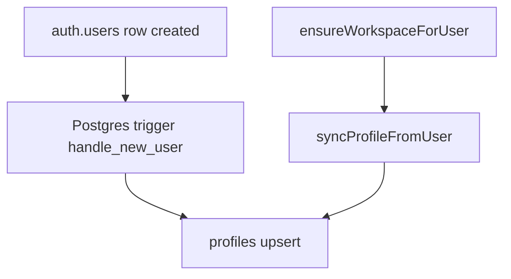
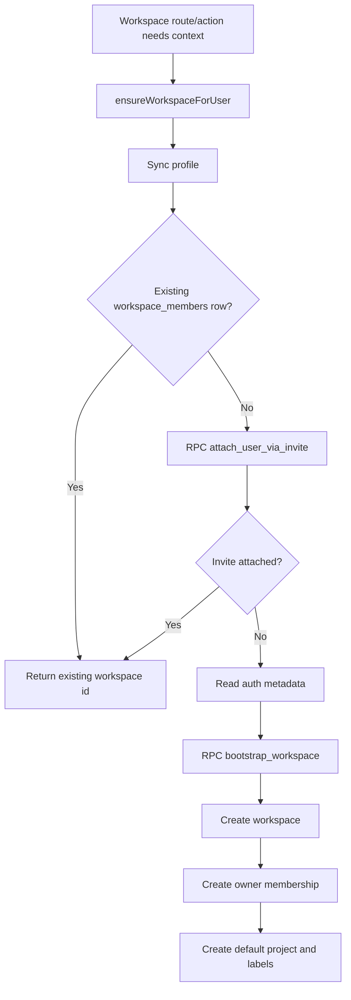
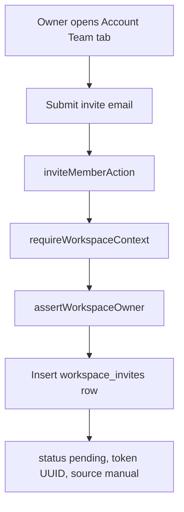
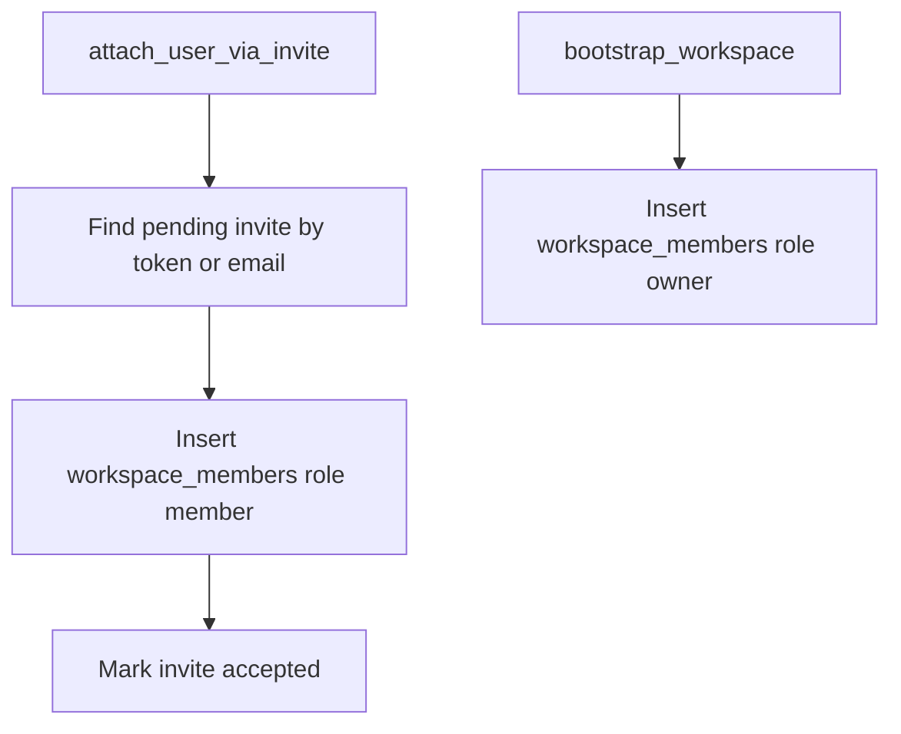
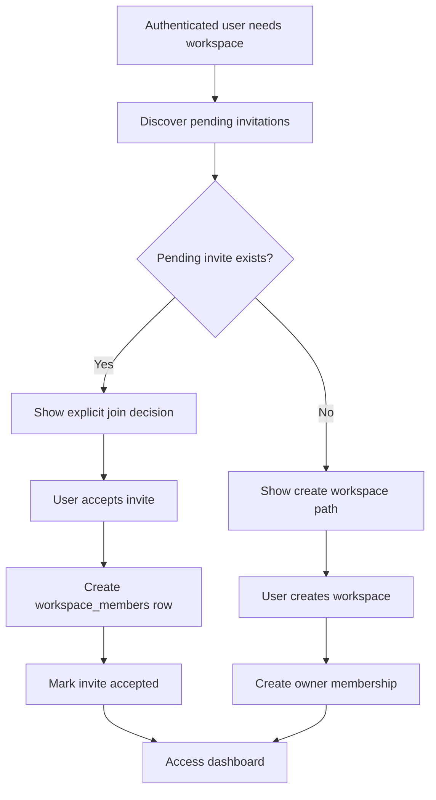
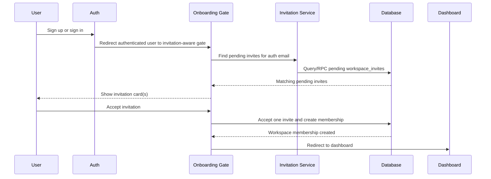
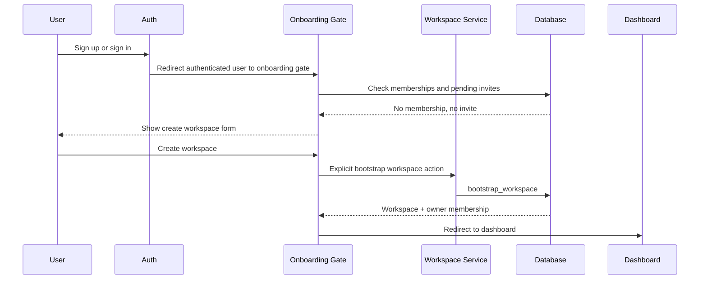
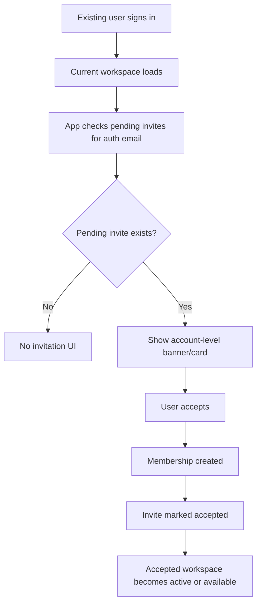

# Workspace Invitation Flow Implementation Plan

This document maps the approved workspace invitation UX direction onto the current YouIn architecture. It is an implementation plan only. It does not include code changes.

## 1. Current Runtime Flow

### Verified Source Map

Core files:

- `apps/web/src/app/signup/page.tsx`
- `apps/web/src/app/login/page.tsx`
- `apps/web/src/app/auth/callback/route.ts`
- `apps/web/src/app/(workspace)/layout.tsx`
- `apps/web/src/lib/workspace/workspace-bootstrap.ts`
- `apps/web/src/lib/workspace/actions/bootstrap.ts`
- `apps/web/src/lib/workspace/actions/session.ts`
- `apps/web/src/lib/workspace/actions/invites.ts`
- `apps/web/src/lib/workspace/actions/team.ts`
- `apps/web/src/app/(workspace)/account/_components/team-tab.tsx`
- `apps/web/src/app/(workspace)/inbox/page.tsx`
- `apps/web/src/app/(workspace)/inbox/use-inbox.ts`
- `apps/web/src/components/app-sidebar.tsx`
- `apps/web/src/components/project-switcher.tsx`
- `apps/web/src/db/schema.ts`
- `apps/web/supabase/setup.sql`
- `apps/web/supabase/onboarding-rpcs.sql`

### Signup Today

```mermaid
flowchart TD
  A[User opens /signup] --> B[Signup form reads ?invite and ?email]
  B --> C{Invite token in URL?}
  C -->|Yes| D[Hide workspace step]
  C -->|No| E[Show workspace step]
  D --> F[Supabase auth.signUp]
  E --> F
  F --> G[Auth metadata saved]
  G --> H[/auth/callback?next=/dashboard]
  H --> I[/dashboard]
  I --> J[(workspace)/layout]
  J --> K[getWorkspaceShellBootstrap]
  K --> L[ensureWorkspaceForUser]
```

Verified behavior:

- `signup/page.tsx` treats a URL invite token as invitation context.
- When `inviteToken` exists, the workspace creation step is hidden.
- Signup stores `invite_token` in auth metadata.
- Signup redirects to `/auth/callback?next=/dashboard`.
- The dashboard route is under `(workspace)/layout.tsx`, which calls `getWorkspaceShellBootstrap()`.
- `getWorkspaceShellBootstrap()` calls `ensureWorkspaceForUser()`.

Important gap:

- `ensureWorkspaceForUser()` currently calls `attach_user_via_invite` without passing the `invite_token` stored in auth metadata.
- Invitation acceptance may still work by matching the authenticated user's email against pending invites, but the token path from signup metadata is not used by the TypeScript bootstrap layer.

### Signin Today

```mermaid
flowchart TD
  A[User opens /login] --> B[Login reads ?next]
  B --> C[Email/password or Google auth]
  C --> D[Redirect to next or /dashboard]
  D --> E[(workspace)/layout]
  E --> F[getWorkspaceShellBootstrap]
  F --> G[ensureWorkspaceForUser]
```

Verified behavior:

- `login/page.tsx` preserves a safe local `next` path.
- Login does not inspect pending invitations.
- The "Create account" link goes to `/signup` and does not preserve invitation context.
- Signed-in users who reach `/dashboard` enter workspace bootstrap immediately.

### Auth Callback Today

```mermaid
flowchart TD
  A[/auth/callback] --> B[Exchange OAuth code or OTP token hash]
  B --> C[Redirect to safe next path]
  C --> D[Usually /dashboard]
```

Verified behavior:

- `auth/callback/route.ts` only completes Supabase auth and redirects.
- It does not create profiles directly.
- It does not inspect invitations.
- It does not create workspaces directly.

### Profile Creation Today



Verified behavior:

- `apps/web/supabase/setup.sql` defines `handle_new_user()` to insert/update `profiles`.
- `ensureWorkspaceForUser()` also calls `syncProfileFromUser(...)`, giving the app a second profile synchronization path.

### Workspace Creation Today



Verified behavior:

- Workspace creation is not triggered in `signup/page.tsx`.
- Workspace creation is triggered lazily by `ensureWorkspaceForUser()`.
- `ensureWorkspaceForUser()` is called by:
  - `getWorkspaceShellBootstrap()` in `actions/bootstrap.ts`
  - `requireWorkspaceContext()` in `actions/session.ts`
  - `createAuthorizedClient()` in `app/api/extension/marks/route.ts`
- Any protected workspace route or workspace-scoped server action can therefore create a workspace.

Product implication:

- Current onboarding is effectively "dashboard bootstrap creates or attaches the workspace."
- There is no separate account-level decision point where a user can explicitly choose "join invited workspace" or "create workspace."

### Invitation Creation Today



Verified behavior:

- `inviteMemberAction(email)` is owner-only.
- It inserts a `workspace_invites` row with:
  - `workspace_id`
  - `email`
  - `invited_by_user_id`
  - `status = pending`
  - `source = manual`
  - `token = crypto.randomUUID()`
- There is no email delivery implementation in this action.
- The UI shows pending invitations to workspace owners in the account Team tab.

### Invitation Discovery Today

Verified behavior:

- Invitee-side discovery is implicit, not visible.
- `attach_user_via_invite(p_token text DEFAULT NULL)` can attach a user by pending invite token or by matching authenticated email.
- `ensureWorkspaceForUser()` calls `attach_user_via_invite` with no token, so it relies on email matching.
- The invitee has no obvious UI surface that lists pending invitations before workspace creation.
- The current Inbox is workspace-scoped and based on mark activity, not account-level invitations.

Important RLS constraint:

- `workspace_invites` RLS in `setup.sql` allows workspace members to select/update/delete invites.
- A non-member invitee cannot directly select invite rows through normal table RLS.
- Invite discovery for matching account email therefore needs a trusted server path or SECURITY DEFINER RPC.

### Workspace Membership Creation Today



Verified behavior:

- Invited users become `workspace_members.role = member`.
- Workspace creators become `workspace_members.role = owner`.
- `attach_user_via_invite` currently accepts by token or by email.
- The SQL implementation does not appear to enforce `expires_at` during acceptance.
- The email-based branch can collect multiple pending invites for the same email and mark all as accepted while returning only one workspace id.

## 2. Target Runtime Flow

The desired MVP direction is:



### Scenario A: User Has Pending Invitation

Desired runtime:



Target properties:

- No email delivery required.
- Invite discovery happens inside YouIn.
- Acceptance is explicit.
- Workspace creation does not occur before the invitation decision.
- The accepted workspace becomes the active workspace for the session.

### Scenario B: User Has No Invitation

Desired runtime:



Target properties:

- Workspace creation remains fast for uninvited new users.
- Creation is explicit, not a side effect of touching `/dashboard`.
- The user cannot accidentally bypass the join opportunity.

### Scenario C: Existing User Receives Invitation Later

Desired runtime:



Target properties:

- Existing users can discover invites without email.
- Users who already own a workspace are not silently moved without consent.
- Because full multi-workspace UX is out of scope, the MVP needs a minimal active workspace concept if accepting an invite should immediately open the invited workspace.

Key architecture implication:

- Current workspace routes do not include `workspaceId`.
- `ensureWorkspaceForUser()` currently chooses a membership without an explicit active workspace selector.
- To support Scenario C reliably, YouIn needs either:
  - a minimal active/primary workspace pointer, or
  - a workspace switcher/route model.

Recommendation for MVP:

- Add a minimal active workspace pointer rather than full multi-workspace UX.
- Keep the UI framed as "current workspace" or "open this workspace" instead of a broad multi-workspace management experience.

## 3. Architecture Changes

### Routes

#### Add account-level onboarding/invitation route outside `(workspace)`

Recommended route:

- `apps/web/src/app/onboarding/page.tsx`

Responsibility:

- Authenticated, but not workspace-scoped.
- Check existing memberships.
- Check pending invitations for the authenticated email.
- Show either:
  - pending invite cards, or
  - create workspace form.

Why it changes:

- Current `(workspace)` layout calls workspace bootstrap and can create a workspace.
- Invitation-aware onboarding needs to run before workspace creation.

#### Optional token route

Recommended route:

- `apps/web/src/app/invite/[token]/page.tsx`

Responsibility:

- Optional direct link support.
- Signed-out users are redirected to login/signup with `next=/invite/[token]`.
- Signed-in users see a token-specific invitation acceptance screen.

Why it changes:

- Email delivery is not required, but token links are still useful for owner copy/link sharing and future email support.

#### Update `/signup`

File:

- `apps/web/src/app/signup/page.tsx`

Responsibility:

- Continue account creation.
- Preserve invite token/email context if present.
- Redirect authenticated users to `/onboarding` or `/invite/[token]`, not directly to `/dashboard`.

Why it changes:

- New users should see pending invitations before workspace creation.
- The workspace step should be controlled by the onboarding gate, not only by URL token presence.

#### Update `/login`

File:

- `apps/web/src/app/login/page.tsx`

Responsibility:

- Preserve invite `next` routes.
- Send general authenticated users to `/onboarding` when workspace state is unresolved.

Why it changes:

- Existing users invited later need a discoverable path after signing in.

#### Update `/auth/callback`

File:

- `apps/web/src/app/auth/callback/route.ts`

Responsibility:

- Continue safe auth exchange.
- Default new authenticated sessions to `/onboarding` instead of `/dashboard` when no explicit `next` exists.

Why it changes:

- `/dashboard` currently triggers workspace creation.
- `/onboarding` can make the join-or-create decision safely.

#### Guard `(workspace)` routes

File:

- `apps/web/src/app/(workspace)/layout.tsx`

Responsibility:

- Load an existing active workspace.
- If the user has no active workspace/membership, redirect to `/onboarding`.
- Avoid creating a workspace as an incidental side effect of loading layout.

Why it changes:

- The layout should not decide whether a user joins or creates.

### Pages And Components

#### Onboarding page

New responsibility:

- Account-level onboarding.
- Invitation discovery.
- Explicit accept invitation.
- Explicit create workspace.

Should not:

- Depend on workspace context.
- Render app sidebar/project switcher.
- Call `requireWorkspaceContext()`.

#### Account Team tab

Files:

- `apps/web/src/app/(workspace)/account/_components/team-tab.tsx`
- `apps/web/src/lib/workspace/actions/team.ts`
- `apps/web/src/lib/workspace/actions/invites.ts`

New responsibility:

- Make clear that invites are discoverable in-app by matching email.
- Show pending, accepted, revoked, and expired states clearly if the data is available.
- For owners, expose copyable invitation link as optional, not required.

#### Inbox

Files:

- `apps/web/src/app/(workspace)/inbox/page.tsx`
- `apps/web/src/app/(workspace)/inbox/use-inbox.ts`
- `apps/web/src/lib/workspace/inbox-query.ts`

New responsibility:

- Secondary discovery surface only.
- Show a banner/card for pending workspace invitations after the user already has a workspace context.

Why secondary:

- Current Inbox is workspace-scoped.
- A user with no workspace cannot safely reach it without triggering bootstrap.

### Server Actions And Services

#### Split workspace resolution from workspace creation

Current file:

- `apps/web/src/lib/workspace/workspace-bootstrap.ts`

Current behavior:

- `ensureWorkspaceForUser()` does three things:
  - syncs profile
  - resolves existing membership or invite
  - creates a workspace if neither exists

Target responsibility split:

- Resolve profile.
- Resolve active workspace membership.
- Discover invitations.
- Accept invitation.
- Create workspace explicitly.

Why it changes:

- The join-or-create model requires workspace creation to be a user decision.
- The current helper name says "ensure", and the implementation guarantees a workspace by creating one. That is the exact behavior the new UX must avoid during invitation discovery.

#### Add invite discovery server action/service

Responsibility:

- Return pending invitations for the authenticated user's email.
- Exclude expired/revoked/accepted invites.
- Return enough display data for cards:
  - workspace name
  - inviter display name/email if available
  - invited email
  - invited_at
  - expires_at
  - source
  - invite id or token reference

Why it changes:

- Invitees cannot directly select `workspace_invites` through current RLS because they are not members yet.

#### Add explicit accept invite action

Responsibility:

- Accept exactly one pending invite.
- Verify invite belongs to the authenticated user's email or valid token.
- Check expiration.
- Insert `workspace_members`.
- Mark invite accepted.
- Set active workspace to the joined workspace.
- Revalidate affected routes.

Why it changes:

- Current `attach_user_via_invite` can accept implicitly during bootstrap.
- MVP requires explicit acceptance.

#### Add explicit create workspace action

Responsibility:

- Call `bootstrap_workspace` only after user chooses "Create workspace."
- Set active workspace to the new workspace.
- Redirect to dashboard.

Why it changes:

- Creation should no longer happen just because a user visited `/dashboard`.

### Middleware

File:

- `apps/web/src/lib/supabase/middleware.ts`

Current behavior:

- Redirects signed-out protected routes to `/login?next=...`.
- Redirects signed-in users away from login/signup to `next` or `/dashboard`.

Required responsibility:

- Treat `/onboarding` and optional `/invite/[token]` as authenticated account-level routes.
- Do not force signed-in users straight to `/dashboard` when their workspace state is unresolved.
- Preserve invite links through login/signup.

### Extension API

File:

- `apps/web/src/app/api/extension/marks/route.ts`

Current behavior:

- `createAuthorizedClient()` calls `ensureWorkspaceForUser()`.

Required responsibility:

- Avoid creating a workspace unexpectedly from extension sync before onboarding.
- If no active workspace exists, return a clear error instructing the web app to complete onboarding.

Why it changes:

- Otherwise the extension can bypass invitation-aware onboarding and create a personal workspace.

## 4. UI Changes

### Onboarding Screens

Location:

- New account-level onboarding route, recommended `/onboarding`.

Purpose:

- Resolve the user's workspace path.

States:

1. Loading account state.
2. Pending invitation found.
3. Multiple pending invitations found.
4. No invitation found, create workspace.
5. Error/expired invitation state.

Primary user actions:

- Accept invitation.
- Create workspace.
- Review another invitation if multiple exist.
- Sign out or switch account if the invitation email does not match.

### Invitation Cards

Location:

- `/onboarding`
- optional `/invite/[token]`
- account-level invitation surface
- secondary dashboard/inbox banner for existing users

Purpose:

- Make the pending invitation concrete and trustworthy.

Recommended card content:

- Workspace name
- Inviter name/email
- Invited email
- Expiration date
- Source label only if useful internally
- Primary action: "Join workspace"
- Secondary action: "Not now" for existing users

Avoid:

- Making email delivery appear required.
- Hiding the workspace name.
- Auto-accepting on page load.

### Account Surfaces

Location:

- Existing owner Team tab: `apps/web/src/app/(workspace)/account/_components/team-tab.tsx`
- New invitee-facing account/invitations surface outside workspace context or inside account once the user has a workspace.

Purpose:

- Owners manage pending invitations.
- Invitees discover pending invitations if they already have an account.

Owner actions:

- Invite by email.
- Copy invite link if token route exists.
- Cancel/revoke invite.
- See status.

Invitee actions:

- Accept invite.
- Ignore/postpone.
- See why the invite is visible.

### Inbox Surface

Location:

- Existing workspace Inbox.

Purpose:

- Secondary reminder for existing users.

Reasoning:

- The current Inbox is not global. It depends on workspace context and unread mark events.
- It should not be the only discovery surface for invitations.

### Invitation Banners

Location:

- Dashboard shell after workspace context loads.
- Inbox top area.
- Account overview or Team tab.

Purpose:

- Notify existing users that another workspace has invited them.

User action:

- Open invitation review screen.
- Accept invite explicitly.

MVP guardrail:

- Do not show banners before the app can reliably set/open the accepted workspace.

## 5. Database Impact

### Existing Tables

#### `workspace_invites`

Current relevant columns:

- `id`
- `workspace_id`
- `email`
- `invited_by_user_id`
- `invited_at`
- `expires_at`
- `accepted_at`
- `status`
- `source`
- `token`
- `order_index`

Current statuses:

- `pending`
- `accepted`
- `revoked`
- `expired`

Required use:

- Treat `pending` as discoverable only when `expires_at > now()`.
- Treat `accepted`, `revoked`, and `expired` as non-actionable.
- Accept only one invite per explicit user action.

Schema change required:

- Not strictly required for basic invite discovery and acceptance.

Recommended schema additions:

- Add `accepted_by_user_id` to record which auth user accepted the invite.
- Consider adding `declined` later if YouIn wants a durable "dismiss" action.

#### `workspace_members`

Current relevant columns:

- `workspace_id`
- `user_id`
- `username`
- `role`
- `created_at`

Current roles:

- `owner`
- `member`

Required use:

- Accepting an invite inserts a `member` row.
- Creating a workspace inserts an `owner` row.

Schema change required:

- No schema change for membership creation.

#### `profiles`

Current relevant columns:

- `id`
- `email`
- `full_name`
- profile/display fields
- `updated_at`

Recommended schema addition:

- Add an active workspace pointer, such as `current_workspace_id` or `primary_workspace_id`.

Why:

- Current dashboard routes are not workspace-id scoped.
- Current resolver returns an existing membership without an explicit active workspace selector.
- Existing users who accept an invite later need a deterministic way to open the accepted workspace without a full multi-workspace UI.

Alternative:

- Store active workspace in a separate `user_workspace_preferences` table.

Recommended MVP choice:

- Prefer a small preference table or nullable profile column over route-wide workspace id changes.

#### `workspaces`

Current relevant columns:

- `id`
- `name`
- `next_mark_seq`
- timestamps

Required use:

- Display workspace name on invitation cards.
- Create workspace only from explicit onboarding action.

#### `projects`

Required use:

- `bootstrap_workspace` creates a default project.
- Invitation acceptance does not need to create a project.

#### `inbox_read_states`

Current relevant columns:

- `workspace_id`
- `user_id`
- `last_read_at`

Impact:

- Current Inbox is workspace-scoped.
- Account-level invitations should not be modeled only as inbox read states in the MVP.

### RLS Impact

Current RLS:

- Workspace members can read workspace invites.
- Invitees who are not yet members cannot directly read invite rows.

Required change:

- Add a safe invite discovery path that can return pending invites for `auth.users.email`.

Safe options:

1. SECURITY DEFINER RPC that returns a limited invite read model for `auth.uid()`.
2. Server action using a trusted server-side database client, with strict filtering by authenticated user email.

Recommendation:

- Use an RPC for acceptance and either RPC or server action for discovery.
- Keep returned invite data minimal and user-facing.

## 6. RPC Impact

### `attach_user_via_invite`

File:

- `apps/web/supabase/onboarding-rpcs.sql`

Current behavior:

- Accepts optional `p_token`.
- If token is present, finds pending invites by token.
- If token is absent, finds pending invites by authenticated email.
- Inserts a `workspace_members` row with role `member`.
- Updates matched invites to `accepted`.
- Returns a workspace id.

Current risks:

- `ensureWorkspaceForUser()` calls it without a token.
- It does not appear to enforce `expires_at`.
- It can aggregate multiple email-matched invites and mark all as accepted while returning one workspace id.
- It does not appear to verify that a token invite email matches the authenticated user's email.
- It is used as implicit bootstrap behavior, not explicit user acceptance.

Desired behavior:

- Accept exactly one invite per user action.
- Require either:
  - a specific invite id,
  - a specific token,
  - or an explicit selected invite returned by discovery.
- Verify:
  - authenticated user exists,
  - invite status is `pending`,
  - invite is not expired,
  - invite email matches authenticated email unless the product deliberately supports transferable invite links,
  - membership does not already exist or is idempotently handled.
- Return a structured result:
  - accepted workspace id,
  - invite status,
  - whether membership was newly created,
  - reason if not accepted.

Recommended strategy:

- Do not keep using `attach_user_via_invite` as an implicit fallback in `ensureWorkspaceForUser`.
- Either replace it with a new explicit RPC, for example `accept_workspace_invite`, or tighten `attach_user_via_invite` and call it only from an explicit server action.

### `bootstrap_workspace`

File:

- `apps/web/supabase/onboarding-rpcs.sql`

Current behavior:

- Creates a workspace.
- Creates owner membership.
- Creates default project.
- Creates default labels.
- Optionally creates signup-source invitations from provided emails.

Desired behavior:

- Keep core creation behavior.
- Call only from explicit "Create workspace" onboarding action.
- Set the resulting workspace as the active workspace.

Required adjustment:

- The RPC itself may not need a major schema change.
- The TypeScript call path should change so workspace creation no longer happens from a generic "ensure" resolver.

## 7. Edge Cases

### Invite Exists

Expected UX:

- User sees invitation before workspace creation.
- User can explicitly join.

Expected runtime:

- Discovery returns pending invite.
- Accept action creates membership.
- Invite becomes accepted.
- User is routed to dashboard for accepted workspace.

### Invite Expired

Expected UX:

- Show an expired state if the user arrived from a token link.
- Do not show expired invites as primary join cards during discovery.
- Tell the user to ask the workspace owner for a new invite.

Expected runtime:

- Accept action refuses expired invites.
- Optional cleanup job or action may mark old `pending` invites as `expired`.

### Invite Revoked

Expected UX:

- If reached by link, show "This invitation is no longer available."
- Do not show revoked invites in pending discovery.

Expected runtime:

- Accept action refuses revoked invites.
- Owner cancellation should preferably set `status = revoked` rather than deleting the row if auditability matters.

Current gap:

- `cancelInviteAction` deletes the invite row today.

### Multiple Invites

Expected UX:

- New users see a choice screen listing all pending invitations.
- Existing users see a pending invitations surface or banner count.
- Acceptance is one workspace at a time.

Expected runtime:

- Discovery returns multiple invite cards.
- Accept action accepts only the selected invite.
- Other invites remain pending.

Current gap:

- Email-based `attach_user_via_invite` may mark multiple invites accepted while attaching only one workspace.

### Wrong Email

Expected UX:

- If signed in with a different email than the invite, show a clear mismatch state.
- Primary action should be "Use another account" or "Sign out."

Expected runtime:

- Token acceptance should verify email match unless YouIn intentionally supports transferable links.

Recommendation:

- For MVP, make invites non-transferable and require email match.

### Existing Account

Expected UX:

- User sees pending invite inside YouIn after sign-in.
- User accepts explicitly.
- If they already have a workspace, the product explains what happens next.

Expected runtime:

- Membership is added.
- Active workspace pointer changes to accepted workspace if user chooses "Join and open."

Required architecture:

- Deterministic active workspace selection.

### Onboarding Interruption

Expected UX:

- Returning to YouIn resumes the unresolved onboarding state.
- No accidental workspace is created by visiting dashboard.

Expected runtime:

- Authenticated user with no membership is redirected to `/onboarding`.
- Pending invites are rechecked on every onboarding load.
- Workspace creation only occurs when the create action is submitted.

### Race Conditions

Cases:

- User double-clicks accept.
- Owner revokes while invitee accepts.
- Invite expires between discovery and acceptance.
- User opens two onboarding tabs and accepts/creates in both.

Expected runtime:

- RPC/action uses a transaction.
- Status checks happen at write time.
- Unique constraints prevent duplicate membership.
- Accept/create actions are idempotent where possible.

### Extension Before Onboarding

Expected UX:

- Extension should not create a personal workspace silently.
- Extension should ask the user to complete onboarding in the web app.

Expected runtime:

- Extension API should return a clear no-workspace/onboarding-required state if no active workspace exists.

## 8. Recommended Implementation Order

### Phase 1: Stabilize Domain Primitives

Goal:

- Make invitation discovery and acceptance safe without changing the whole UI.

Work:

- Add a trusted invite discovery path for the authenticated user's email.
- Add or tighten an explicit invite acceptance RPC/action.
- Enforce pending status and expiration at acceptance time.
- Accept one invite only.
- Verify email match.
- Add tests around multiple invites and expired/revoked invites.

Independently testable by:

- Calling server action/RPC with seeded invites.
- Verifying `workspace_members` and `workspace_invites` rows.

### Phase 2: Separate Workspace Resolution From Creation

Goal:

- Stop accidental workspace creation before invitation decisions.

Work:

- Refactor the workspace bootstrap service conceptually into:
  - profile sync,
  - active membership resolution,
  - explicit invite acceptance,
  - explicit workspace creation.
- Update workspace layout behavior so no-membership users redirect to onboarding instead of creating a workspace.
- Update extension API behavior to require completed onboarding.

Independently testable by:

- Signing up with no invite and confirming no workspace is created until create action.
- Signing up with invite and confirming no personal workspace is created before acceptance.

### Phase 3: Build Account-Level Onboarding Gate

Goal:

- Give new users the correct join-or-create decision.

Work:

- Add `/onboarding` outside `(workspace)`.
- Show pending invite cards when invites exist.
- Show create workspace form when no invite exists.
- Redirect completed users to `/dashboard`.
- Update signup/login/callback default redirects to pass through onboarding.

Independently testable by:

- New user with one invite.
- New user with multiple invites.
- New user with no invite.
- Returning user with incomplete onboarding.

### Phase 4: Active Workspace Selection For Existing Users

Goal:

- Let existing users accept invitations later without full multi-workspace UX.

Work:

- Add minimal active workspace persistence.
- Make accepted workspace active after explicit "Join and open."
- Make dashboard resolver use active workspace when available.
- Fall back safely when active workspace is missing or inaccessible.

Independently testable by:

- User owns workspace A.
- User accepts invite to workspace B.
- Dashboard opens workspace B.
- User does not see arbitrary workspace selection based on database row order.

### Phase 5: Owner And Existing-User UI Surfaces

Goal:

- Make invitations discoverable for owners and existing invitees.

Work:

- Update Team tab invitation language.
- Show invitation status clearly.
- Add optional copyable invite link.
- Add dashboard/account/inbox invitation banner for existing users.
- Keep Inbox as secondary discovery, not the only surface.

Independently testable by:

- Owner sends invite and sees pending state.
- Invitee already signed in sees banner.
- Invitee accepts and gains access.
- Owner sees accepted state.

### Phase 6: Hardening And Polish

Goal:

- Cover edge cases and prevent confusing states.

Work:

- Expired/revoked invite screens.
- Wrong-email screen.
- Multiple invite choice screen.
- Loading/error/empty states.
- Mobile responsive QA.
- Audit logging or accepted-by metadata if added.

Independently testable by:

- Manual scenario matrix.
- Database verification.
- UI review on desktop and mobile.

## 9. Testing Plan

### Manual Scenario Tests

#### Scenario A: New User With One Invite

Setup:

- Kanata owns workspace.
- Kanata invites Hind's email.
- Hind has no account.

Expected:

- Hind signs up with the invited email.
- Hind lands on onboarding/invitation screen.
- Hind sees Kanata workspace invitation.
- Hind clicks "Join workspace."
- Hind reaches dashboard for Kanata workspace.
- No personal Hind workspace is created.
- `workspace_members` contains Hind as member of Kanata workspace.
- Invite status becomes `accepted`.

#### Scenario B: New User With No Invite

Setup:

- New email has no pending invites.

Expected:

- User signs up.
- User lands on onboarding create workspace screen.
- User creates workspace.
- User reaches dashboard.
- `workspace_members` contains user as owner.
- No invite rows are created unless explicitly entered.

#### Scenario C: New User With Multiple Invites

Setup:

- Sara and Kanata each invite Hind's email to different workspaces.

Expected:

- Hind signs up.
- Hind sees multiple invitation cards.
- Hind accepts one.
- Only the selected invite becomes accepted.
- Other invite remains pending.
- Hind reaches selected workspace.

#### Scenario D: Existing User Invited Later

Setup:

- Hind already owns Hind workspace.
- Kanata invites Hind.

Expected:

- Hind signs in.
- Hind sees pending invitation banner/card.
- Hind accepts explicitly.
- Hind gains membership in Kanata workspace.
- Dashboard opens the accepted workspace or clearly confirms how to access it.
- Hind's original workspace is not deleted.

#### Scenario E: Expired Invite

Setup:

- Invite `expires_at` is in the past.

Expected:

- Invite does not appear as an actionable pending card.
- Token route shows expired state if used.
- Accept action refuses it.
- No membership is created.

#### Scenario F: Revoked Invite

Setup:

- Owner revokes invite before invitee accepts.

Expected:

- Invite does not appear in discovery.
- Token route shows unavailable state if used.
- Accept action refuses it.
- No membership is created.

#### Scenario G: Wrong Email

Setup:

- Invite is for `hind@example.com`.
- User signs in as `amin@example.com`.

Expected:

- Token route shows email mismatch.
- Accept action refuses it.
- No membership is created.

#### Scenario H: Onboarding Interruption

Setup:

- New invited user signs up, closes browser before accepting.

Expected:

- Returning to `/dashboard` redirects to onboarding.
- Invitation still appears if pending and unexpired.
- Workspace is not created automatically.

#### Scenario I: Extension Before Onboarding

Setup:

- New authenticated user has not accepted invite or created workspace.
- Extension tries to create/fetch marks.

Expected:

- API returns onboarding-required state.
- No workspace is created implicitly.

### Runtime Verification

For each scenario, inspect:

- `profiles`
- `workspaces`
- `workspace_members`
- `workspace_invites`
- `projects`

Key assertions:

- Workspace creation happens only after explicit create action.
- Membership creation from invite happens only after explicit accept action.
- Expired/revoked invites cannot create membership.
- Multiple invites are not bulk accepted accidentally.
- Existing users have deterministic active workspace behavior.

### UX Verification

Check:

- The user always understands whether they are joining or creating.
- The product does not imply email delivery is required.
- Invitation cards identify the workspace and inviter.
- Empty states are clear.
- Workspace owner sees pending/accepted/revoked status.
- Existing user invitation banner does not interrupt primary work.
- Mobile layouts do not hide the primary join/create action.

## 10. Final Recommendation

The smallest safe MVP path is:

1. Add a trusted pending-invite discovery path for the authenticated user's email.
2. Add explicit single-invite acceptance with status, expiration, and email checks.
3. Add `/onboarding` outside the workspace layout.
4. Redirect signup/login/callback through `/onboarding` before `/dashboard`.
5. Stop using generic workspace bootstrap as the place where invitation acceptance and workspace creation are silently decided.
6. Keep workspace creation explicit through the no-invite onboarding branch.
7. Add a minimal active workspace pointer before fully supporting existing-user invitation acceptance.
8. Use Inbox only as a secondary reminder because the current Inbox is workspace-scoped.

Recommended MVP product shape:

```mermaid
flowchart TD
  A[User signs in] --> B[/onboarding]
  B --> C{Has active workspace?}
  C -->|Yes| D[/dashboard]
  C -->|No| E{Has pending invites?}
  E -->|Yes| F[Show invitations]
  F --> G[Accept one]
  G --> H[Set active workspace]
  H --> D
  E -->|No| I[Create workspace]
  I --> J[Set active workspace]
  J --> D
```

This aligns with YouIn's current architecture while removing the main source of confusion: workspace creation currently happens as a side effect of entering workspace runtime. The best product and engineering move is to make the workspace decision explicit, account-level, and discoverable before the dashboard loads.
