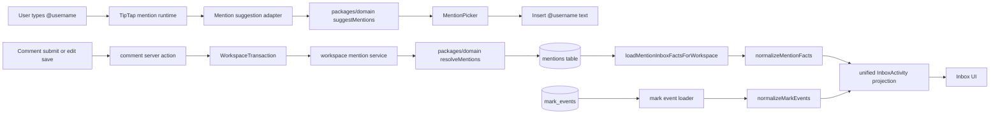
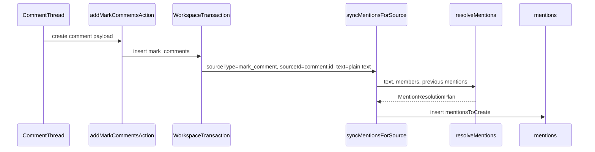
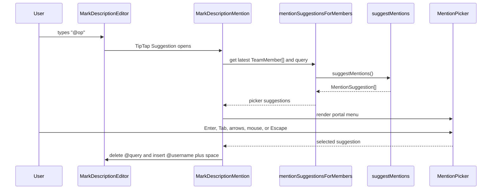
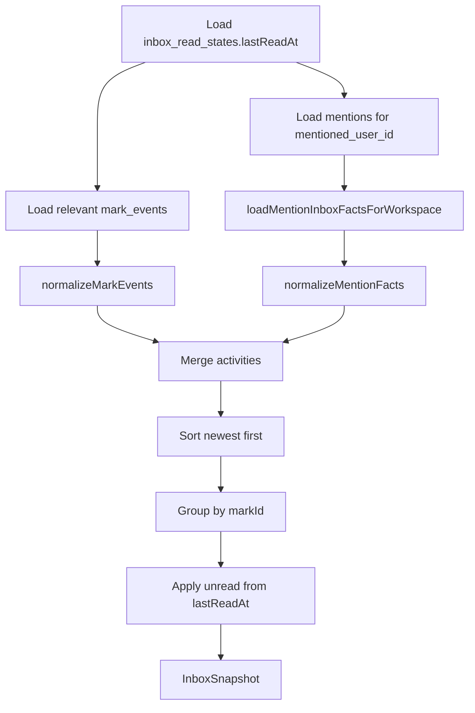

# Collaboration Mentions - Engineering Implementation Report

**Status:** Implemented on `feature/collaboration-mentions`  
**Project:** YouIn  
**Last reviewed:** 2026-06-27  
**Primary scope:** Comment mentions, mention persistence, TipTap mention runtime, and Inbox integration

## Executive Summary

Collaboration Mentions introduce a structured collaboration primitive for YouIn. A mention is no longer just text that happens to contain `@username`; it is parsed, resolved against workspace membership, persisted by stable user identity, and projected into Inbox activity.

The implementation deliberately separates the feature into independent layers:

- `packages/domain/src/mentions/` owns parsing, resolution, and suggestion rules.
- `apps/web/src/lib/workspace/mentions.ts` bridges domain decisions to database writes.
- `apps/web/src/lib/workspace/actions/comments.ts` synchronizes comment mentions inside existing workspace transactions.
- `apps/web/src/components/dashboard/` provides a reusable TipTap mention runtime and picker.
- `apps/web/src/lib/workspace/inbox-query.ts` loads mention facts, normalizes them into Inbox activities, and applies existing unread semantics.
- `apps/web/src/app/(workspace)/inbox/` renders mention activities through the existing Inbox UI.

The completed branch supports mentions in comment creation and comment edit mode, stores mention rows in the database, and renders mention activities in Inbox with unread state. It intentionally does not implement notifications, realtime delivery, mark description persistence, extension integration, mention highlighting, hover cards, or profile popovers.

## Feature Structure

The feature spans the shared domain package and the web application. The domain package owns reusable business rules; the web app owns database persistence, editor runtime, comment integration, and Inbox projection.

```text
packages/
+-- domain/
    +-- src/
        +-- index.ts
        +-- mentions/
            +-- index.ts
            +-- parse.ts
            +-- resolve.ts
            +-- suggest.ts
            +-- types.ts
            +-- *.test.ts

apps/
+-- web/
    +-- drizzle/
    |   +-- 0026_mentions.sql
    +-- supabase/
    |   +-- setup.sql
    +-- src/
        +-- db/
        |   +-- schema.ts
        +-- components/dashboard/
        |   +-- mark-description-editor.tsx
        |   +-- mark-description-mention.tsx
        |   +-- mention-picker.tsx
        |   +-- mention-suggestion-adapter.ts
        |   +-- suggestion-menu-position.ts
        +-- lib/workspace/
        |   +-- mentions.ts
        |   +-- inbox-model.ts
        |   +-- inbox-query.ts
        |   +-- actions/comments.ts
        +-- app/(workspace)/inbox/
            +-- use-inbox.ts
            +-- inbox-view.tsx
```

## Responsibilities by Layer

### Domain

- Parse mention text from plain strings.
- Resolve parsed usernames against supplied workspace members.
- Classify ignored mentions.
- Diff new text against previous persisted mentions.
- Rank mention suggestions.

### Persistence

- Store durable mention facts in `mentions`.
- Synchronize mention rows for a source.
- Convert database rows into domain input models.
- Convert domain resolution plans into insert/delete operations.

### Server Actions

- Keep comment behavior and authorization unchanged.
- Invoke mention synchronization inside existing workspace transactions.
- Revalidate existing workspace views after mutations.

### Editor Runtime

- Detect `@` inside TipTap editors.
- Request suggestions through the adapter.
- Manage suggestion lifecycle and keyboard handling.
- Insert selected mentions as plain `@username ` text.

### UI

- Render the mention picker.
- Show avatars, names, usernames, selected state, and empty state.
- Preserve accessibility roles and editor focus.

### Inbox

- Load mention facts separately from `mark_events`.
- Normalize collaboration sources into `InboxActivity`.
- Apply existing unread rules.
- Render mention activities through the existing Inbox UI.

## Product Goals

Before this work, comments could contain names but the system could not understand who was referenced. That prevented Inbox surfacing, future notifications, collaboration analytics, and cross-surface reuse.

The product goal was to convert a textual reference into durable collaboration data while keeping the model reusable beyond comments. The first production integration is mark comments, but the persistence model and domain API are source-agnostic so future surfaces can opt in without redesigning the feature.

Current supported surface:

- Mark comments

Designed future surfaces:

- Mark descriptions
- Extension notes
- Rich text collaboration surfaces
- Future server-generated collaboration events

## Design Principles

### Domain Logic Is Shared

Mention parsing, resolution, and suggestion ranking live in `packages/domain`. These rules are dependency-free and do not import React, TipTap, Drizzle, Supabase, server actions, or browser APIs.

This keeps business behavior reusable by the web app, extension, tests, and future services.

### Persistence Uses Stable Identity

Mention rows reference users by stable user IDs:

- `mentioned_user_id`
- `created_by_user_id`

The parser and editor work with usernames because that is what users type, but persisted mention identity never depends on username or display name. Usernames and display names can change without invalidating historical mentions.

### Mentions Are Not Comment-Owned

The database model uses a generic `(source_type, source_id)` pair with optional `mark_id` context. The current source type is `mark_comment`, but the table is not named or shaped as a comment-only table.

This prevents future duplication when descriptions, extension notes, or other collaboration surfaces add mentions.

### Existing Architecture Is Extended, Not Replaced

The implementation reuses:

- Existing workspace transaction boundaries.
- Existing comment server actions.
- Existing TipTap editor component.
- Existing workspace member data.
- Existing Inbox read state.
- Existing Inbox grouping and rendering patterns.

No parallel transaction system, unread model, member lookup system, or Inbox UI stack was introduced.

## Implementation History

The branch was implemented as a sequence of small, reviewable commits:

| Commit | Purpose |
| --- | --- |
| `fb90e65` | Shared mention parser foundation in `packages/domain`. |
| `ae148c7` | `mentions` database table, indexes, relations, and RLS policies. |
| `4bf3aa5` | Pure `resolveMentions()` domain decision engine. |
| `32d2519` | Server-side mention persistence service. |
| `331b02c` | Comment create/update/delete synchronization. |
| `4b6c5df` | Pure `suggestMentions()` domain suggestion engine. |
| `53dd7dc` | Reusable TipTap mention runtime and picker. |
| `54f268a` | Comment composer integration. |
| `83a1002` | Stable editor lifecycle using getter/ref runtime data. |
| `34e0782` | Comment edit mode integration. |
| `d283255` | Mention read model foundation for Inbox. |
| `670b0e4` | Unified Inbox activity projection. |
| `8924a6b` | Mention rendering in Inbox. |
| `529b084` | Mentions participate in Inbox unread state. |

## Architecture Overview



Important boundary: the editor only inserts text. Persistence happens later through existing comment submission and edit flows.

## Domain Model

Domain code lives in `packages/domain/src/mentions/`.

### Parser

Files:

- `packages/domain/src/mentions/parse.ts`
- `packages/domain/src/mentions/types.ts`
- `packages/domain/src/mentions/index.test.ts`

`parseMentions(text)` scans plain text and returns `ParsedMention[]` with:

- `username`
- `start`
- `end`

The parser is intentionally limited to parsing. It does not validate workspace membership, resolve users, create notifications, read the database, or understand editor-specific structures.

Username rules:

- Minimum length: `2`
- Maximum length: `32`
- Must start with a lowercase ASCII letter.
- May contain lowercase ASCII letters, digits, and underscores after the first character.
- Must have a safe boundary before `@`.
- Must end at whitespace, supported punctuation, or end of string.

The parser avoids false positives such as email addresses and repeated `@` prefixes.

### Resolver

Files:

- `packages/domain/src/mentions/resolve.ts`
- `packages/domain/src/mentions/resolve.test.ts`

`resolveMentions(input)` is the domain decision engine. It receives plain data:

- text
- workspace members
- previous persisted mentions
- current user ID

It returns a `MentionResolutionPlan`:

- `parsedMentions`
- `resolvedMentions`
- `mentionsToCreate`
- `mentionsToDelete`
- `notificationTargets`
- `ignoredMentions`

Business rules:

- Unknown usernames are ignored with reason `unknown_username`.
- Self mentions are ignored with reason `self_mention`.
- Duplicate mentions of the same user are ignored with reason `duplicate_mention`.
- Diffing uses `(userId, start, end)` occurrence keys.
- `notificationTargets` includes newly mentioned users and is currently a domain output only.

The resolver does not return database rows or Drizzle types. Persistence-specific conversion belongs to the web server layer.

### Suggestions

Files:

- `packages/domain/src/mentions/suggest.ts`
- `packages/domain/src/mentions/suggest.test.ts`

`suggestMentions(input)` returns plain mention suggestion models:

- `userId`
- `username`
- `displayName`
- `avatarUrl`

Business rules:

- Empty query returns all workspace members.
- Search is case-insensitive.
- Exact username matches rank first.
- Usernames starting with the query rank before usernames containing the query.
- Ordering is deterministic by rank, username, display name, and user ID.
- The current user is not filtered by the suggestion engine. Self filtering belongs to resolution, not suggestions.

## Persistence Layer

Files:

- `apps/web/drizzle/0026_mentions.sql`
- `apps/web/src/db/schema.ts`
- `apps/web/supabase/setup.sql`

The `mentions` table stores durable mention facts.

| Column | Purpose |
| --- | --- |
| `id` | Stable mention row identity. |
| `workspace_id` | Workspace isolation and query partitioning. |
| `source_type` | Generic source discriminator such as `mark_comment`. |
| `source_id` | Stable ID of the source record. |
| `mark_id` | Optional mark context for mark-scoped sources and cascade cleanup. |
| `mentioned_user_id` | Stable identity of the mentioned user. |
| `created_by_user_id` | Stable identity of the actor who created the mention. |
| `start_index` | Plain-text start offset of the mention occurrence. |
| `end_index` | Plain-text end offset of the mention occurrence. |
| `created_at` | Creation timestamp used by Inbox ordering and unread logic. |

Indexes:

- `mentions_source_occurrence_unique` prevents duplicate persisted occurrences for the same source/user/offset.
- `mentions_source_idx` supports synchronization by `(workspace_id, source_type, source_id)`.
- `mentions_mentioned_user_created_at_idx` supports Inbox lookups for a mentioned user.
- `mentions_created_by_user_created_at_idx` supports future actor-centric queries.
- `mentions_mark_idx` supports mark-context lookups and cleanup paths.

RLS policies:

- Workspace members can select mention rows in their workspace.
- Authenticated users can insert only as themselves.
- Inserts require the mentioned user to be a workspace member.
- Workspace members can delete mention rows.

The schema intentionally uses `source_type text` rather than a database enum. This avoids migration churn when new collaboration surfaces are added.

## Server Synchronization Flow

Files:

- `apps/web/src/lib/workspace/mentions.ts`
- `apps/web/src/lib/workspace/actions/comments.ts`

`apps/web/src/lib/workspace/mentions.ts` is the persistence service. It is server-only and uses the existing `WorkspaceTransaction` pattern.

Responsibilities:

- Load workspace members from `workspace_members`.
- Load previously persisted mentions for a source.
- Convert database rows into domain inputs.
- Call `resolveMentions()`.
- Convert `mentionsToCreate` and `mentionsToDelete` into database writes.
- Delete all mentions for a source when needed.

It intentionally does not:

- Own authorization.
- Open its own transaction.
- Send notifications.
- Invalidate queries.
- Import React, TipTap, or UI code.

### Comment Create



`addMarkCommentsAction()` inserts comments first, then synchronizes mentions for each created text comment inside the same workspace transaction. Image comments are skipped because they have no mentionable text body.

### Comment Update

`updateMarkCommentAction()` updates the comment body and then calls `syncMentionsForSource()` with the updated plain text. The resolver computes additions, removals, and unchanged mentions from the previous persisted state.

### Comment Delete

`deleteMarkCommentAction()` calls `deleteMentionsForSource()` before deleting the comment inside the same transaction.

This keeps comment state and mention state consistent without changing the existing authorization model.

## TipTap Runtime and Suggestion Picker

Files:

- `apps/web/src/components/dashboard/mark-description-editor.tsx`
- `apps/web/src/components/dashboard/mark-description-mention.tsx`
- `apps/web/src/components/dashboard/mention-suggestion-adapter.ts`
- `apps/web/src/components/dashboard/mention-picker.tsx`
- `apps/web/src/components/dashboard/suggestion-menu-position.ts`
- `apps/web/src/components/dashboard/mark-description-slash.tsx`

The editor runtime detects `@`, asks the domain suggestion engine for candidates through an adapter, renders a picker, and inserts plain `@username ` text.

### Runtime Lifecycle



### Adapter Boundary

`mention-suggestion-adapter.ts` maps `TeamMember` into `MentionSuggestionMember` and calls `suggestMentions()`. The TipTap extension does not contain search or ranking logic.

### Picker Responsibilities

`MentionPicker` renders:

- Avatar or fallback initials.
- Display name.
- Username.
- Highlighted selected row.
- Empty state.
- `listbox` and `option` accessibility roles.

It does not own filtering, ranking, persistence, or editor commands.

### Keyboard Behavior

When the mention picker is open:

- `ArrowDown` moves to the next suggestion.
- `ArrowUp` moves to the previous suggestion.
- `Enter` selects the active suggestion.
- `Tab` selects the active suggestion and prevents focus escape.
- `Escape` closes the mention suggestion.
- Mouse down selects a suggestion without blurring the editor.

Selecting a mention never submits a comment.

### Portal Positioning

The runtime reuses the same portal positioning strategy as the slash menu through `resolveSuggestionMenuPosition()`. The picker mounts into the editor overlay layer when available and falls back to `document.body` only when no mount parent exists.

This keeps menus correctly positioned inside modals and editor containers without creating a second positioning system.

## Stable Editor Lifecycle

`MarkDescriptionEditor` always registers `MarkDescriptionMention`, but the extension reads runtime data through getter callbacks:

- `isEnabled: () => mentionMembersRef.current !== undefined`
- `getMembers: () => mentionMembersRef.current ?? []`

`mentionMembers` is stored in a React ref and intentionally excluded from the `useEditor()` dependency list.

This design keeps the TipTap editor instance stable when workspace members change. Only the mention runtime observes fresh data.

Why this matters:

- No editor recreation.
- No focus loss.
- No plugin reset.
- No temporary missing `CharacterCount` storage during recreation.
- No stale member closures.
- The pattern can be reused by future editor runtimes such as Emoji, AI, or richer slash command data sources.

## Comment Composer and Edit Mode Integration

File:

- `apps/web/src/components/dashboard/comment-thread.tsx`

`CommentThread` reads workspace members from existing workspace data:

- `useWorkspaceData((s) => s.workspace.members)`

The same `mentionMembers` collection is passed into:

- The comment composer `MarkDescriptionEditor`.
- Each editable comment `MarkDescriptionEditor`.

No new member query was introduced.

Composer behavior:

- Typing `@` opens the picker.
- Selecting a member inserts `@username `.
- The Send button still controls submission.
- Mention selection does not submit the comment.

Edit behavior:

- Typing `@` opens the same picker.
- `Enter` and `Tab` select suggestions while the picker is open.
- `Escape` closes the picker first.
- `Cmd/Ctrl + Enter` still saves when the picker is closed.
- `Escape` still cancels edit when the picker is closed.

The edit container checks `event.defaultPrevented` before handling editor-level shortcuts, allowing the TipTap suggestion plugin to consume mention keys first.

## Inbox Architecture

Files:

- `apps/web/src/lib/workspace/inbox-model.ts`
- `apps/web/src/lib/workspace/inbox-query.ts`
- `apps/web/src/app/(workspace)/inbox/use-inbox.ts`
- `apps/web/src/app/(workspace)/inbox/inbox-view.tsx`

The Inbox implementation is query-driven. It builds a read model from persisted collaboration facts when the Inbox snapshot is loaded.

Before mentions, Inbox was driven by `mark_events` and the existing `inbox_read_states` table. This implementation adds mentions as a second collaboration source without merging mention loading into `mark_events`.

### Read Model Types

`inbox-model.ts` adds:

- `InboxCollaborationSourceType = "mark_event" | "mention"`
- `InboxActivityType = MarkEventType | "mention"`
- `InboxActivity`
- `InboxPerson`
- `InboxMentionFact`
- Mention source and context interfaces

`InboxActivity` is the normalized projection model used after source-specific facts are loaded.

## Unified Inbox Projection

`inbox-query.ts` now follows this pipeline:



### Mention Fact Loading

`loadMentionInboxFactsForWorkspace()` loads mention rows where:

- `mentions.workspace_id` matches the current workspace.
- `mentions.mentioned_user_id` is the current user.
- `mentions.created_by_user_id` is not the current user.

It enriches each row with:

- Actor profile/member data.
- Mentioned user profile/member data.
- Mark context.
- Comment/source context when `source_type` is `mark_comment`.
- Plain-text preview for comment sources.
- Mention offsets and creation timestamp.

Mention loading stays separate from mark event loading. This keeps each source responsible for its own joins and enrichment.

### Normalization

`normalizeMarkEvents()` converts mark event rows into `InboxActivity`.

`normalizeMentionFacts()` converts mention facts into `InboxActivity` with:

- `sourceType: "mention"`
- `type: "mention"`
- stable activity ID `mention:${mention.id}`
- `contextType` and `contextId` for source-aware navigation
- optional comment preview

Mention facts without mark context are skipped today because the existing Inbox grouping model is mark-based. This is an intentional compatibility boundary, not a database limitation.

### Sorting and Grouping

Activities from all sources are merged and sorted by `createdAt` newest first, with activity ID as a deterministic tie-breaker. The existing grouping pipeline groups activities by `markId`.

This keeps mark event behavior unchanged while allowing mentions to participate as first-class activities.

## Inbox Rendering and Navigation

`use-inbox.ts` adds display text for `type === "mention"`:

- `mentioned you in a comment` when the context is `mark_comment`
- `mentioned you` as a fallback

`inbox-view.tsx` renders mention activities through the existing Inbox row component. The row includes:

- Actor chip.
- Existing mark display key and title.
- Mention summary text.
- Comment preview when available.
- Existing timestamp and unread dot.

Navigation:

- Mention activities open the related mark.
- For comment mentions, the link appends `#comment-${contextId}`.
- If context is unavailable or unsupported, the link falls back to the mark URL.

The renderer consumes the normalized `InboxEvent` model. It does not query database tables or know about the `mentions` schema.

## Inbox Unread Model

The implementation reuses `inbox_read_states.lastReadAt`.

Unread calculation is source-agnostic:

- If `lastReadAt` is empty, activities are unread.
- If `activity.createdAt > lastReadAt`, the activity is unread.
- Otherwise, the activity is read.

This logic is applied after normalization on the common `InboxActivity` model. Mark events and mention activities share the same unread pipeline and the same Inbox unread count.

No second unread table, flag, or client-side mention-specific unread calculation was introduced.

## End-to-End Runtime Lifecycle

### Authoring Flow

1. A user types `@` in a comment composer or edit-mode editor.
2. TipTap `MarkDescriptionMention` opens the suggestion runtime if `mentionMembers` is available.
3. The runtime calls `mentionSuggestionsForMembers()`.
4. The adapter maps `TeamMember[]` to domain suggestion members.
5. `suggestMentions()` ranks and returns domain suggestions.
6. `MentionPicker` renders candidates.
7. The user selects a candidate.
8. The editor deletes the current `@query` range and inserts `@username `.
9. The editor remains focused.
10. The user submits or saves through the existing comment flow.

### Persistence Flow

1. `addMarkCommentsAction()` or `updateMarkCommentAction()` normalizes comment HTML.
2. The action enters `withWorkspaceActor()` and uses the existing workspace transaction.
3. The comment row is inserted or updated.
4. The action converts stored comment HTML to plain text with `markDescriptionPlainText()`.
5. The action calls `syncMentionsForSource()` with `sourceType = "mark_comment"`.
6. The persistence service loads workspace members and previous mentions.
7. The service calls `resolveMentions()`.
8. Removed mention occurrences are deleted.
9. New mention occurrences are inserted with `onConflictDoNothing()`.
10. The action revalidates existing workspace views.

### Inbox Flow

1. The Inbox query loads `lastReadAt`.
2. The query loads relevant `mark_events`.
3. The query independently loads mention facts for the current user.
4. Each source is normalized into `InboxActivity`.
5. Activities are merged, sorted, grouped, and marked unread.
6. The Inbox UI renders the resulting `InboxSnapshot`.

## Architectural Decisions

| Decision | Why it was chosen | Alternative rejected |
| --- | --- | --- |
| Put parsing, resolution, and suggestions in `packages/domain`. | Keeps core business rules reusable and testable without app dependencies. | Embedding mention logic in React, TipTap, or server actions. |
| Persist user IDs, not usernames. | User IDs are stable; usernames can change. | Storing only text or username references. |
| Use generic `source_type` and `source_id`. | Supports comments now and future surfaces later. | A comment-only mentions table. |
| Keep persistence service in `apps/web`. | It depends on Drizzle schema and workspace transactions, which are web server concerns. | Moving database write logic into `packages/domain`. |
| Invoke mention sync inside existing comment transactions. | Keeps comment and mention state consistent. | Async post-processing or separate transactions. |
| Keep editor runtime text-based. | Persistence already derives mentions from submitted content. | Inserting custom mention nodes before the product needs rich mention rendering. |
| Use getter/ref pattern for editor runtime data. | Keeps TipTap editor stable while suggestions see fresh members. | Passing `mentionMembers` as a `useEditor()` dependency and recreating the editor. |
| Add mentions as a second Inbox source. | Preserves mark event behavior and allows future sources to follow the same model. | Encoding mentions as synthetic `mark_events`. |
| Calculate unread on normalized activities. | Keeps unread source-agnostic. | Adding mention-specific unread logic in UI. |

## Performance Considerations

The implementation avoids avoidable runtime work without introducing premature optimization.

- The TipTap editor instance remains stable when workspace members change because `mentionMembers` is read through getter/ref callbacks instead of `useEditor()` dependencies.
- Mention suggestions reuse the existing workspace member data already loaded by `CommentThread`; no new client-side member fetch is introduced.
- Suggestion results are deterministic, which keeps keyboard navigation and tests stable across renders.
- Mention synchronization loads only the previous mentions for the current source using `(workspace_id, source_type, source_id)`.
- New mention inserts use the unique source-occurrence index plus `onConflictDoNothing()` for conflict-safe persistence.
- Inbox mention loading is query-driven and normalized into the existing projection pipeline instead of adding renderer-level database logic.
- Unread calculation runs once on normalized `InboxActivity` records, so mark events and mentions share the same read-state path.

## Boundaries and Non-Goals

The implemented scope intentionally leaves several product capabilities for later commits. These are architectural boundaries, not missing dependencies.

- Notification delivery.
- Realtime mention subscriptions.
- Mention rendering/highlighting inside stored comment bodies.
- Hover cards or profile popovers.
- Mention picker integration in mark description persistence.
- Chrome extension mention UI or persistence.
- Backfill of historical comments.
- New Inbox grouping for non-mark collaboration surfaces.
- Custom TipTap mention nodes.

These are future layers that can build on the current parser, resolver, persistence table, and Inbox projection.

## Known Limitations

- Mentions are inserted and stored as plain text `@username`, not custom TipTap mention nodes.
- Stored comment bodies do not render mention highlights or profile hover cards.
- Notification delivery is not implemented.
- Realtime Inbox or mention updates are not implemented.
- Mark description mention persistence is not wired yet.
- Chrome extension mention UX and persistence are pending.
- The current Inbox grouping model is mark-based, so mention facts without mark context are not rendered.
- There is no historical backfill for comments that existed before the `mentions` table.

## Future Evolution

### Notifications

`resolveMentions()` already returns `notificationTargets`, but no notification delivery happens in this branch. A future notification service should consume the persistence service result or an equivalent transaction-local plan and emit notifications after mention persistence succeeds.

### Realtime

Mentions are persisted and queryable, but this branch does not add a realtime subscription path for `mentions`. A future realtime implementation should decide whether to stream mention rows directly or stream Inbox invalidation events.

### Mark Descriptions

The editor runtime is already reusable by `MarkDescriptionEditor`, but mention persistence is currently wired only for comments. Mark description integration should call `syncMentionsForSource()` from the mark description server action using a new source type such as `mark_description`.

### Extension

The domain layer is already reusable by the extension because it is dependency-free. Extension integration should avoid duplicating parsing, resolution, or suggestion ranking, and should reuse the same persistence contract through the appropriate server or sync path.

### Rich Mention Rendering

The current implementation stores plain text and offsets. Future rendering can use persisted offsets, parser output, or a richer editor representation. That should be introduced only when the product needs visual mention chips or profile hover behavior.

### Inbox Sources Beyond Mentions

The `InboxActivity` normalization path can support sources such as reactions, review requests, approvals, and AI collaboration events. New sources should add dedicated loaders and normalizers rather than adding source-specific logic to the renderer.

## Engineering Lessons

- Business rules stay easier to test and reuse when they live in the domain layer instead of UI or persistence code.
- UI can provide a rich authoring experience without owning durable collaboration state.
- Editor runtimes should observe changing product data without tying the editor instance to React render dependencies.
- Database persistence should store stable identities, not mutable display values.
- Generic source modeling scales better than feature-specific tables when a concept is intended to become a collaboration primitive.
- Read models should be built from durable facts and normalized before rendering.
- Source-specific loading belongs near the query layer; source-agnostic rendering belongs near the UI layer.

## Important File Map

| Area | Files |
| --- | --- |
| Domain parser/resolver/suggestions | `packages/domain/src/mentions/` |
| Domain public exports | `packages/domain/src/index.ts`, `packages/domain/src/mentions/index.ts` |
| Database schema and migration | `apps/web/src/db/schema.ts`, `apps/web/drizzle/0026_mentions.sql`, `apps/web/supabase/setup.sql` |
| Server persistence service | `apps/web/src/lib/workspace/mentions.ts` |
| Comment synchronization | `apps/web/src/lib/workspace/actions/comments.ts` |
| TipTap editor runtime | `apps/web/src/components/dashboard/mark-description-mention.tsx` |
| Suggestion adapter | `apps/web/src/components/dashboard/mention-suggestion-adapter.ts` |
| Picker UI | `apps/web/src/components/dashboard/mention-picker.tsx` |
| Shared suggestion positioning | `apps/web/src/components/dashboard/suggestion-menu-position.ts` |
| Editor host | `apps/web/src/components/dashboard/mark-description-editor.tsx` |
| Comment composer/edit integration | `apps/web/src/components/dashboard/comment-thread.tsx` |
| Inbox read model | `apps/web/src/lib/workspace/inbox-model.ts` |
| Inbox projection/query | `apps/web/src/lib/workspace/inbox-query.ts` |
| Inbox client hook/rendering | `apps/web/src/app/(workspace)/inbox/use-inbox.ts`, `apps/web/src/app/(workspace)/inbox/inbox-view.tsx` |

## Validation Summary

Engineering verification performed for this implementation:

- Reviewed every commit on `feature/collaboration-mentions` relative to `main`.
- Reviewed every file touched by the mentions feature.
- Verified the domain parser, resolver, and suggestion tests cover parsing edge cases, duplicate handling, unknown users, self mentions, edits, removals, empty inputs, and deterministic suggestion ordering.
- Verified mention persistence uses stable user IDs and workspace-scoped source identity.
- Verified comment create, update, and delete flows synchronize mentions inside existing workspace transactions.
- Verified the TipTap runtime uses a stable editor lifecycle and reads fresh workspace members through getter/ref callbacks.
- Verified composer and edit mode use the same mention runtime and existing workspace member data.
- Verified Inbox loading keeps mention facts separate from `mark_events`, normalizes both into `InboxActivity`, and applies unread state through the existing `lastReadAt` model.
- Verified mention Inbox rendering uses the existing Inbox row UI and falls back to mark navigation when source context is unavailable.
- Documentation formatting check: `git diff --check -- docs/engineering/collaboration-mentions/IMPLEMENTATION_REPORT.md`.
- Domain validation: `pnpm.cmd --filter @youin/domain test` passed with 29 tests.
- Web type validation: `pnpm.cmd exec tsc --noEmit --project apps/web/tsconfig.json` passed.
